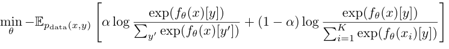
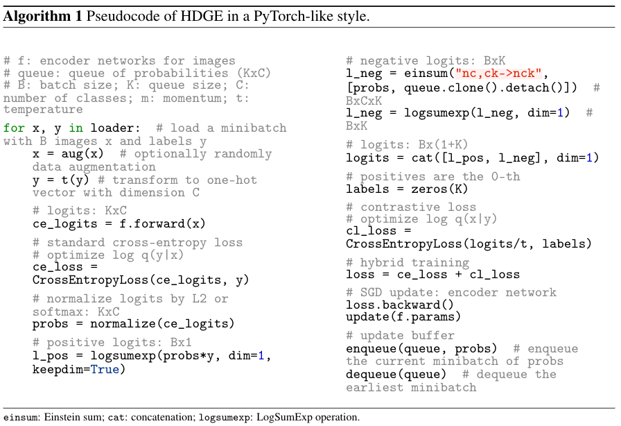

This is the official code for the paper [Hybrid Discriminative-Generative Training via Contrastive Learning](http://arxiv.org/abs/2007.09070).


This is code is built upon the official code of the great work [JEM](https://github.com/wgrathwohl/JEM).

> Contrastive learning and supervised learning have both seen significant progress and success.  However, thus far they have largely been treated as two separate objectives, brought together only by having a shared neural network.  In this paper we show that through the perspective of hybrid discriminative-generative training of energy-based models we can make a direct connection between contrastive learning and supervised learning.
> Beyond presenting this unified view, we show our specific choice of approximation of the energy-based loss outperforms the existing practice in terms of classification accuracy of WideResNet on CIFAR-10 and CIFAR-100. It also leads to improved performance on robustness, out-of-distribution detection, and calibration.





Includes codes and scripts for training our method UDGE and baselines using WideResNet.

For any questions/issues please contact hao.liu@cs.berkeley.edu.

## Usage
The experiment environemnt is provided in [this conda env](conda.yaml).
### Training
To train a model on CIFAR10 as in the paper
```markdown
# Baseline model: JEM: log q(y|x) + log q(x)
python train_wrn.py --lr .0001 --dataset cifar10 --optimizer adam --pyxce 1.0 --pxsgld 1.0 --sigma .03 --width 10 --depth 28 --warmup_iters 1000 --log_dir ./save --id YOUR_EXP_ID

# UDGE: log q(y|x) + log q(x|y)
python train_wrn.py --lr .0001 --dataset cifar10 --optimizer adam --pyxce 1.0 --pxycontrast 1.0 --sigma .03 --width 10 --depth 28 --warmup_iters 1000 --log_dir ./save --id YOUR_EXP_ID

# UDGE + marginal likelihood: log q(y|x) + log q(x|y) + log q(x) (for generative tasks)
python train_wrn.py --lr .0001 --dataset cifar10 --optimizer adam --pyxce 1.0 --pxycontrast 1.0 --pxsgld 1.0 --sigma .03 --width 10 --depth 28 --warmup_iters 1000 --log_dir ./save --id YOUR_EXP_ID
```
***NOTE***

The experiments of the paper basically followed the setup of [JEM](https://github.com/wgrathwohl/JEM), where a couple changes were made to accommodate energy-based model training.
Compared with [the original training setup](https://github.com/szagoruyko/wide-residual-networks/tree/master/pytorch), the changes are no batch normalization, Adam as optimizer instead of SGD with momentum, decay epochs difference, warmu learning rate, and decay rate difference.
These changes can downgrade the classification accuracy, if one is more interested in accuracy, set the following configs
```markdown
python train_wrn.py --dataset cifar10 --pyxce 1.0 --pxycontrast 1.0 --width 10 --depth 28 --warmup_iters -1 --lr .1 --norm batch --optimizer sgd --batch_size 128 --dropout_rate .3 --weight_decay .0005 --log_dir ./save --id YOUR_EXP_ID
```
Details about experiment setup can be found in experiment section of [our paper](http://arxiv.org/abs/2007.09070), where for each experiment we detailed whether batch normalization is used or not.

You can use the [viskit](viskit) from [this open souce code](https://github.com/vitchyr/viskit) to track the experiment progress.

Stay tuned for pretrained model and distributed code that scales better.


### Evaluation

To generate a histogram of calibration error
```markdown
python eval_wrn.py --load_path /PATH/TO/YOUR/MODEL.pt --eval eval_ece --dataset cifar10_test --log_dir ./save/evaluation/ece_hist
```
To generate a histogram of OOD scores
```markdown
python eval_wrn.py --load_path /PATH/TO/YOUR/MODEL.pt --eval logp_hist --datasets cifar10 svhn --log_dir ./save/evaluation/ood_hist
```
To evaluate the classifier accuracy (on CIFAR10):
```markdown
python eval_wrn.py --load_path /PATH/TO/YOUR/MODEL.pt --eval test_clf --dataset cifar_test --log_dir ./save/evaluation/cls
```
To do OOD detection (on CIFAR100)
```markdown
python eval_wrn.py --load_path /PATH/TO/YOUR/MODEL.pt --eval OOD --ood_dataset cifar100 --log_dir ./save/evaluation/ood
```
To generate new unconditional samples
```markdown
python eval_wrn.py --load_path /PATH/TO/YOUR/MODEL.pt --eval uncond_samples --log_dir ./save/evaluation/uncondsample --n_sample_steps {THE_MORE_THE_BETTER (1000 minimum)} --buffer_size 10000 --n_steps 40 --print_every 100 --reinit_freq 0.05
```
To generate new conditional samples
```markdown
python eval_wrn.py --load_path /PATH/TO/YOUR/MODEL.pt --eval cond_samples --log_dir ./save/evaluation/condsample --n_sample_steps {THE_MORE_THE_BETTER (1000 minimum)} --buffer_size 10000 --n_steps 40 --print_every 10 --reinit_freq 0.05 --fresh_samples
```


### Acknowledgement

This code is based on [this open source implementation](https://github.com/wgrathwohl/JEM). The UDGE model is adapted from [this open source code](https://github.com/facebookresearch/moco).
